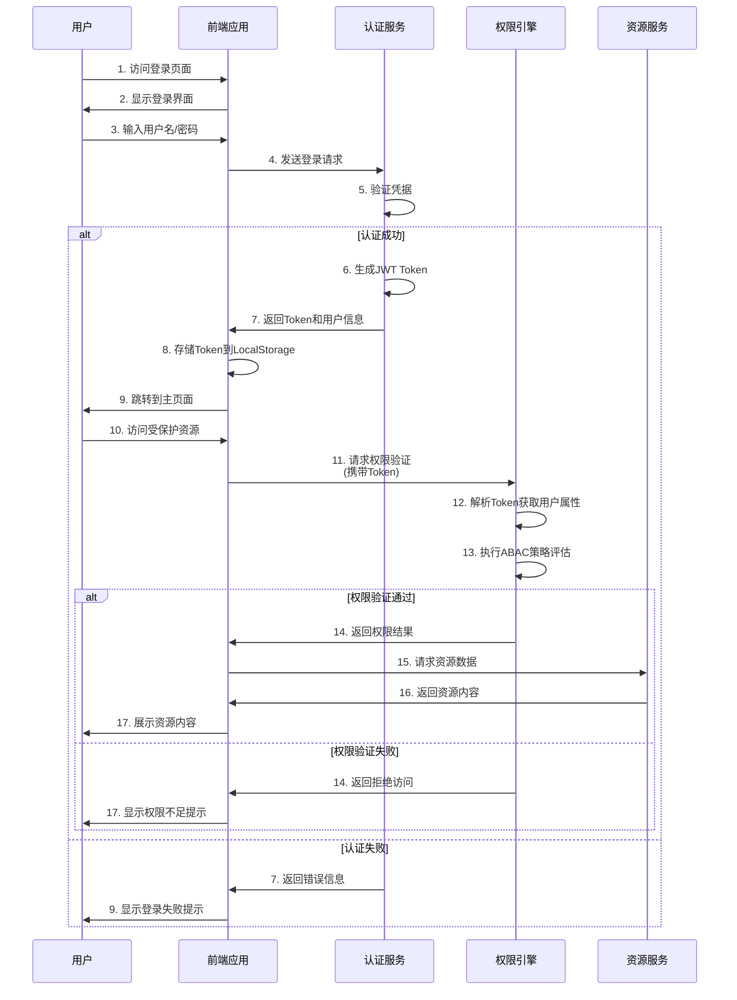
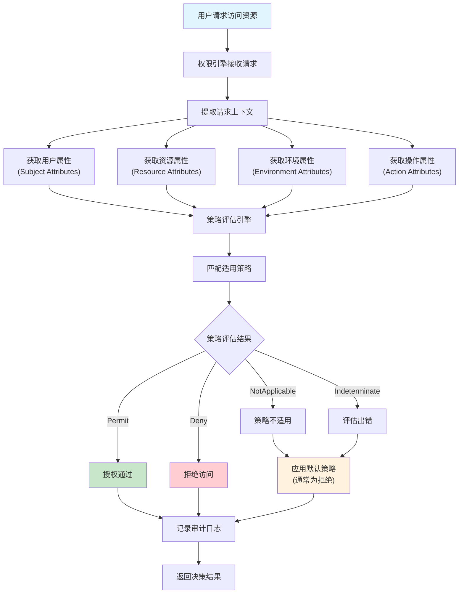
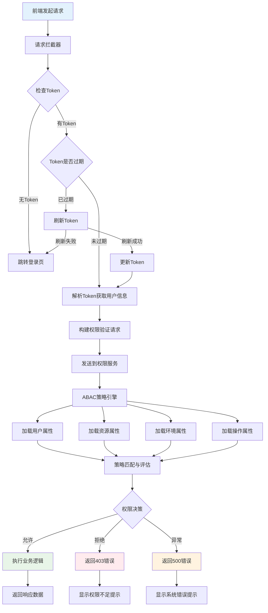
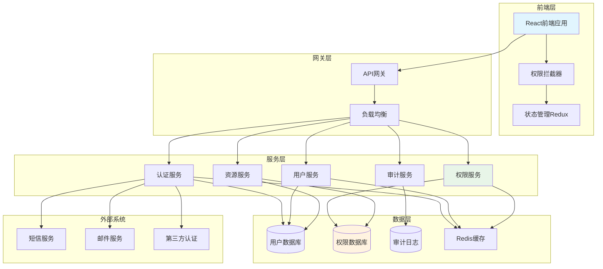
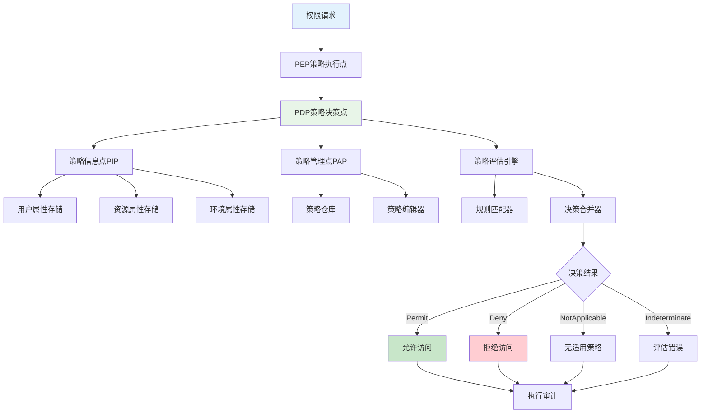

# 基于ABAC权限模型的权限管理系统

## 系统概述

本项目是一个基于**属性基访问控制（ABAC，Attribute-Based Access Control）**模型的现代化权限管理系统。系统提供细粒度的权限控制，支持动态权限策略配置，能够满足复杂企业环境下的权限管理需求。

## 技术架构

### 前端技术栈
- **框架**: Vue 3 + TypeScript
- **UI组件库**: Ant Design Vue 4.x
- **构建工具**: Vite
- **状态管理**: Pinia
- **路由管理**: Vue Router 4.x
- **HTTP客户端**: Axios
- **图标库**: FontAwesome + Ant Design Icons
- **特效**: TSParticles（登录页面粒子效果）

### 后端技术栈
- **框架**: Spring Boot 3.5.4
- **安全框架**: Spring Security 6.x
- **数据库**: MySQL 8.x
- **ORM框架**: MyBatis Plus 3.5.12
- **缓存**: Redis
- **JWT**: Auth0 Java JWT 4.5.0
- **API文档**: SpringDoc OpenAPI 3
- **数据库版本管理**: Liquibase
- **Java版本**: JDK 17

## ABAC权限模型设计

### 1. 核心概念

#### 1.1 四大要素
- **主体（Subject）**: 用户、角色、部门等
- **客体（Object）**: 资源、数据、功能模块等
- **操作（Action）**: 增删改查、审批、导出等
- **环境（Environment）**: 时间、地点、设备、网络等

#### 1.2 属性分类
```
主体属性：
- 用户ID、用户名、用户组
- 部门组、项目组、职能组、安全等级组
- 用户标签、用户状态、组成员类型

客体属性：
- 资源类型、资源ID
- 创建者、所属部门/项目
- 数据分类、敏感级别

环境属性：
- 访问时间、IP地址
- 设备类型、网络环境
- 地理位置、安全域

用户组属性：
- 组类型（部门/项目/职能/安全/自定义）
- 组层级、组路径
- 组自定义属性、成员权限级别
```

### 2. 用户组设计优势

#### 2.1 为什么选择用户组而非传统角色？

**传统角色模型的局限性：**
- 角色定义相对固定，难以适应复杂组织结构
- 一个用户通常只能有一个主要角色
- 权限分配粒度粗糙，灵活性不足
- 难以处理临时权限和跨部门协作场景

**用户组模型的优势：**

1. **多维度分组支持**
   ```
   部门组：技术部、产品部、市场部
   项目组：项目A组、项目B组
   职能组：开发组、测试组、运维组
   安全组：管理员组、审计员组
   临时组：临时项目组、培训组
   ```

2. **灵活的成员关系**
   - 支持多组成员身份（一个用户可以属于多个组）
   - 不同组内的权限级别（成员/管理员/拥有者）
   - 支持时间限制的组成员关系

3. **层次化组织结构**
   ```
   公司
   ├── 技术部门组
   │   ├── 后端开发组
   │   ├── 前端开发组
   │   └── 测试组
   └── 产品部门组
       ├── 产品经理组
       └── UI设计组
   ```

4. **动态属性配置**
   - 每个组可以定义自己的属性
   - 支持组级别的权限策略配置
   - 便于实现基于组属性的ABAC策略

#### 2.2 用户组类型设计

```typescript
enum GroupType {
  DEPARTMENT = 'department',  // 部门组
  PROJECT = 'project',        // 项目组  
  FUNCTION = 'function',      // 职能组
  SECURITY = 'security',      // 安全组
  CUSTOM = 'custom'           // 自定义组
}

enum MemberType {
  MEMBER = 'MEMBER',          // 普通成员
  ADMIN = 'ADMIN',           // 组管理员
  OWNER = 'OWNER'            // 组拥有者
}
```

### 3. 数据库设计

#### 3.1 核心表结构

```sql
-- 用户表
CREATE TABLE `user` (
    `id` BIGINT AUTO_INCREMENT PRIMARY KEY,
    `username` VARCHAR(50) UNIQUE NOT NULL,
    `password` VARCHAR(255) NOT NULL,
    `nickname` VARCHAR(50),
    `email` VARCHAR(100),
    `phone` VARCHAR(20),
    `avatar` VARCHAR(255),
    `status` TINYINT DEFAULT 1 COMMENT '1-正常，0-禁用',
    `create_time` DATETIME DEFAULT CURRENT_TIMESTAMP,
    `update_time` DATETIME DEFAULT CURRENT_TIMESTAMP ON UPDATE CURRENT_TIMESTAMP,
    `deleted` TINYINT DEFAULT 0
);

-- 用户组表
CREATE TABLE `user_group` (
    `id` BIGINT AUTO_INCREMENT PRIMARY KEY,
    `name` VARCHAR(100) NOT NULL,
    `code` VARCHAR(100) UNIQUE NOT NULL,
    `type` VARCHAR(50) NOT NULL COMMENT '组类型：department/project/function/security/custom',
    `parent_id` BIGINT DEFAULT 0 COMMENT '父组ID，支持层次结构',
    `level` INT DEFAULT 1 COMMENT '组层级',
    `path` VARCHAR(500) COMMENT '组路径，如：/company/tech/backend',
    `description` VARCHAR(500),
    `attributes` JSON COMMENT '组自定义属性',
    `status` TINYINT DEFAULT 1,
    `create_time` DATETIME DEFAULT CURRENT_TIMESTAMP,
    `update_time` DATETIME DEFAULT CURRENT_TIMESTAMP ON UPDATE CURRENT_TIMESTAMP,
    `deleted` TINYINT DEFAULT 0,
    INDEX `idx_parent_id` (`parent_id`),
    INDEX `idx_type` (`type`),
    INDEX `idx_path` (`path`)
);

-- 用户组成员关联表
CREATE TABLE `user_group_member` (
    `id` BIGINT AUTO_INCREMENT PRIMARY KEY,
    `user_id` BIGINT NOT NULL,
    `group_id` BIGINT NOT NULL,
    `member_type` ENUM('MEMBER', 'ADMIN', 'OWNER') DEFAULT 'MEMBER' COMMENT '成员类型',
    `join_time` DATETIME DEFAULT CURRENT_TIMESTAMP,
    `expire_time` DATETIME NULL COMMENT '过期时间，NULL表示永不过期',
    `create_time` DATETIME DEFAULT CURRENT_TIMESTAMP,
    UNIQUE KEY `uk_user_group` (`user_id`, `group_id`),
    INDEX `idx_group_id` (`group_id`),
    INDEX `idx_member_type` (`member_type`)
);

-- 资源表
CREATE TABLE `resource` (
    `id` BIGINT AUTO_INCREMENT PRIMARY KEY,
    `name` VARCHAR(100) NOT NULL,
    `code` VARCHAR(100) UNIQUE NOT NULL,
    `type` VARCHAR(50) NOT NULL COMMENT '资源类型：menu/component/api/data',
    `parent_id` BIGINT DEFAULT 0,
    `path` VARCHAR(255),
    `method` VARCHAR(10),
    `description` VARCHAR(200),
    `status` TINYINT DEFAULT 1,
    `create_time` DATETIME DEFAULT CURRENT_TIMESTAMP,
    `update_time` DATETIME DEFAULT CURRENT_TIMESTAMP ON UPDATE CURRENT_TIMESTAMP,
    `deleted` TINYINT DEFAULT 0
);

-- 权限策略表（ABAC核心）
CREATE TABLE `permission_policy` (
    `id` BIGINT AUTO_INCREMENT PRIMARY KEY,
    `name` VARCHAR(100) NOT NULL,
    `description` VARCHAR(500),
    `subject_attributes` JSON COMMENT '主体属性条件',
    `object_attributes` JSON COMMENT '客体属性条件',
    `action_attributes` JSON COMMENT '操作属性条件',
    `environment_attributes` JSON COMMENT '环境属性条件',
    `effect` ENUM('PERMIT', 'DENY') DEFAULT 'PERMIT',
    `priority` INT DEFAULT 0 COMMENT '策略优先级',
    `status` TINYINT DEFAULT 1,
    `create_time` DATETIME DEFAULT CURRENT_TIMESTAMP,
    `update_time` DATETIME DEFAULT CURRENT_TIMESTAMP ON UPDATE CURRENT_TIMESTAMP,
    `deleted` TINYINT DEFAULT 0
);

-- 属性定义表
CREATE TABLE `attribute_definition` (
    `id` BIGINT AUTO_INCREMENT PRIMARY KEY,
    `name` VARCHAR(100) NOT NULL,
    `code` VARCHAR(100) UNIQUE NOT NULL,
    `type` ENUM('SUBJECT', 'OBJECT', 'ACTION', 'ENVIRONMENT') NOT NULL,
    `data_type` ENUM('STRING', 'NUMBER', 'BOOLEAN', 'DATE', 'LIST') NOT NULL,
    `description` VARCHAR(200),
    `status` TINYINT DEFAULT 1,
    `create_time` DATETIME DEFAULT CURRENT_TIMESTAMP,
    `update_time` DATETIME DEFAULT CURRENT_TIMESTAMP ON UPDATE CURRENT_TIMESTAMP,
    `deleted` TINYINT DEFAULT 0
);

-- 用户属性表
CREATE TABLE `user_attribute` (
    `id` BIGINT AUTO_INCREMENT PRIMARY KEY,
    `user_id` BIGINT NOT NULL,
    `attribute_code` VARCHAR(100) NOT NULL,
    `attribute_value` VARCHAR(500) NOT NULL,
    `create_time` DATETIME DEFAULT CURRENT_TIMESTAMP,
    `update_time` DATETIME DEFAULT CURRENT_TIMESTAMP ON UPDATE CURRENT_TIMESTAMP,
    UNIQUE KEY `uk_user_attr` (`user_id`, `attribute_code`)
);

-- 操作日志表
CREATE TABLE `operation_log` (
    `id` BIGINT AUTO_INCREMENT PRIMARY KEY,
    `user_id` BIGINT,
    `username` VARCHAR(50),
    `operation` VARCHAR(100),
    `resource_type` VARCHAR(50),
    `resource_id` VARCHAR(100),
    `result` ENUM('SUCCESS', 'FAILED') DEFAULT 'SUCCESS',
    `ip_address` VARCHAR(50),
    `user_agent` VARCHAR(500),
    `create_time` DATETIME DEFAULT CURRENT_TIMESTAMP
);
```

#### 3.2 数据表字段详细说明

##### 3.2.1 用户表 (user)
| 字段名 | 类型 | 说明 | 约束 |
|--------|------|------|------|
| id | BIGINT | 用户唯一标识 | 主键，自增 |
| username | VARCHAR(50) | 用户名，用于登录 | 唯一，非空 |
| password | VARCHAR(255) | 加密后的密码，使用BCrypt加密 | 非空 |
| nickname | VARCHAR(50) | 用户昵称，显示名称 | 可空 |
| email | VARCHAR(100) | 邮箱地址，用于找回密码等 | 可空 |
| phone | VARCHAR(20) | 手机号码，用于短信验证 | 可空 |
| avatar | VARCHAR(255) | 头像URL地址 | 可空 |
| status | TINYINT | 用户状态：1-正常，0-禁用 | 默认1 |
| create_time | DATETIME | 创建时间 | 默认当前时间 |
| update_time | DATETIME | 更新时间 | 自动更新 |
| deleted | TINYINT | 软删除标记：0-未删除，1-已删除 | 默认0 |

##### 3.2.2 用户组表 (user_group)
| 字段名 | 类型 | 说明 | 约束 |
|--------|------|------|------|
| id | BIGINT | 用户组唯一标识 | 主键，自增 |
| name | VARCHAR(100) | 用户组名称，如"技术部"、"项目Alpha组" | 非空 |
| code | VARCHAR(100) | 用户组编码，如"TECH_DEPT"、"PROJECT_ALPHA" | 唯一，非空 |
| type | VARCHAR(50) | 组类型：department(部门)/project(项目)/function(职能)/security(安全)/custom(自定义) | 非空 |
| parent_id | BIGINT | 父组ID，支持层次结构，0表示顶级组 | 默认0 |
| level | INT | 组层级，从1开始，便于查询和展示 | 默认1 |
| path | VARCHAR(500) | 组路径，如"/company/tech/backend"，便于权限继承 | 可空，有索引 |
| description | VARCHAR(500) | 用户组描述说明 | 可空 |
| attributes | JSON | 组的自定义属性，JSON格式存储键值对 | 可空 |
| status | TINYINT | 组状态：1-启用，0-禁用 | 默认1 |
| create_time | DATETIME | 创建时间 | 默认当前时间 |
| update_time | DATETIME | 更新时间 | 自动更新 |
| deleted | TINYINT | 软删除标记：0-未删除，1-已删除 | 默认0 |

##### 3.2.3 用户组成员关联表 (user_group_member)
| 字段名 | 类型 | 说明 | 约束 |
|--------|------|------|------|
| id | BIGINT | 关联记录唯一标识 | 主键，自增 |
| user_id | BIGINT | 用户ID | 非空，有索引 |
| group_id | BIGINT | 用户组ID | 非空，有索引 |
| member_type | ENUM | 成员类型：MEMBER(普通成员)/ADMIN(组管理员)/OWNER(组所有者) | 默认MEMBER，有索引 |
| join_time | DATETIME | 加入时间 | 默认当前时间 |
| expire_time | DATETIME | 过期时间，NULL表示永不过期，支持临时权限 | 可空 |
| create_time | DATETIME | 记录创建时间 | 默认当前时间 |

##### 3.2.4 资源表 (resource)
| 字段名 | 类型 | 说明 | 约束 |
|--------|------|------|------|
| id | BIGINT | 资源唯一标识 | 主键，自增 |
| name | VARCHAR(100) | 资源名称，如"用户管理"、"财务报表" | 非空 |
| code | VARCHAR(100) | 资源编码，如"USER_MGMT"、"FINANCE_REPORT" | 唯一，非空 |
| type | VARCHAR(50) | 资源类型：menu(菜单)/component(前端组件)/api(接口)/data(数据) | 非空 |
| parent_id | BIGINT | 父资源ID，支持层次结构，0表示顶级资源 | 默认0 |
| path | VARCHAR(255) | 资源路径，如"/user/list"、"/api/users" | 可空 |
| method | VARCHAR(10) | HTTP方法，如GET、POST、PUT、DELETE | 可空 |
| description | VARCHAR(200) | 资源描述说明 | 可空 |
| status | TINYINT | 资源状态：1-启用，0-禁用 | 默认1 |
| create_time | DATETIME | 创建时间 | 默认当前时间 |
| update_time | DATETIME | 更新时间 | 自动更新 |
| deleted | TINYINT | 软删除标记：0-未删除，1-已删除 | 默认0 |

##### 3.2.5 权限策略表 (permission_policy)
| 字段名 | 类型 | 说明 | 约束 |
|--------|------|------|------|
| id | BIGINT | 策略唯一标识 | 主键，自增 |
| name | VARCHAR(100) | 策略名称，如"部门数据访问策略" | 非空 |
| description | VARCHAR(500) | 策略详细描述 | 可空 |
| subject_attributes | JSON | 主体属性条件，如用户组、部门、角色等 | 可空 |
| object_attributes | JSON | 客体属性条件，如资源类型、数据分类等 | 可空 |
| action_attributes | JSON | 操作属性条件，如操作类型、权限级别等 | 可空 |
| environment_attributes | JSON | 环境属性条件，如时间、地点、网络、设备等 | 可空 |
| effect | ENUM | 策略效果：PERMIT(允许)/DENY(拒绝) | 默认PERMIT |
| priority | INT | 策略优先级，数值越大优先级越高，用于冲突解决 | 默认0 |
| status | TINYINT | 策略状态：1-启用，0-禁用 | 默认1 |
| create_time | DATETIME | 创建时间 | 默认当前时间 |
| update_time | DATETIME | 更新时间 | 自动更新 |
| deleted | TINYINT | 软删除标记：0-未删除，1-已删除 | 默认0 |

##### 3.2.6 属性定义表 (attribute_definition)
| 字段名 | 类型 | 说明 | 约束 |
|--------|------|------|------|
| id | BIGINT | 属性定义唯一标识 | 主键，自增 |
| name | VARCHAR(100) | 属性名称，如"部门"、"安全等级" | 非空 |
| code | VARCHAR(100) | 属性编码，如"department"、"security_level" | 唯一，非空 |
| type | ENUM | 属性类型：SUBJECT(主体)/OBJECT(客体)/ACTION(操作)/ENVIRONMENT(环境) | 非空 |
| data_type | ENUM | 数据类型：STRING(字符串)/NUMBER(数字)/BOOLEAN(布尔)/DATE(日期)/LIST(列表) | 非空 |
| description | VARCHAR(200) | 属性描述说明 | 可空 |
| status | TINYINT | 属性状态：1-启用，0-禁用 | 默认1 |
| create_time | DATETIME | 创建时间 | 默认当前时间 |
| update_time | DATETIME | 更新时间 | 自动更新 |
| deleted | TINYINT | 软删除标记：0-未删除，1-已删除 | 默认0 |

##### 3.2.7 用户属性表 (user_attribute)
| 字段名 | 类型 | 说明 | 约束 |
|--------|------|------|------|
| id | BIGINT | 用户属性记录唯一标识 | 主键，自增 |
| user_id | BIGINT | 用户ID | 非空 |
| attribute_code | VARCHAR(100) | 属性编码，引用attribute_definition.code | 非空 |
| attribute_value | VARCHAR(500) | 属性值，如"技术部"、"高级" | 非空 |
| create_time | DATETIME | 创建时间 | 默认当前时间 |
| update_time | DATETIME | 更新时间 | 自动更新 |

##### 3.2.8 操作日志表 (operation_log)
| 字段名 | 类型 | 说明 | 约束 |
|--------|------|------|------|
| id | BIGINT | 日志记录唯一标识 | 主键，自增 |
| user_id | BIGINT | 操作用户ID | 可空 |
| username | VARCHAR(50) | 操作用户名 | 可空 |
| operation | VARCHAR(100) | 操作类型，如"CREATE_USER"、"UPDATE_POLICY" | 可空 |
| resource_type | VARCHAR(50) | 资源类型，如"USER"、"POLICY"、"GROUP" | 可空 |
| resource_id | VARCHAR(100) | 资源ID | 可空 |
| result | ENUM | 操作结果：SUCCESS(成功)/FAILED(失败) | 默认SUCCESS |
| ip_address | VARCHAR(50) | 操作者IP地址 | 可空 |
| user_agent | VARCHAR(500) | 用户代理信息 | 可空 |
| create_time | DATETIME | 操作时间 | 默认当前时间 |

### 4. 系统功能模块

#### 4.1 用户认证模块
- ✅ **用户注册**: 多步骤注册流程，包含账户信息、身份验证、注册完成
- ✅ **用户登录**: 支持用户名/密码登录和手机验证码登录
- ✅ **JWT认证**: 基于JWT的无状态认证机制
- 🔄 **单点登录**: 支持多应用单点登录
- 🔄 **多因子认证**: 短信验证码、邮箱验证等

#### 4.2 用户管理模块
- 🔄 **用户信息管理**: 用户基本信息CRUD操作
- 🔄 **用户状态管理**: 启用/禁用用户账户
- 🔄 **用户属性管理**: 动态配置用户属性
- 🔄 **用户分组管理**: 按部门、项目等维度分组

#### 4.3 用户组管理模块
- 🔄 **用户组管理**: 多类型用户组的创建、编辑、删除
- 🔄 **组成员管理**: 用户组成员的添加、移除、权限管理
- 🔄 **组层次结构**: 支持用户组的父子关系和继承
- 🔄 **动态分组**: 基于属性的自动用户组分配
- 🔄 **组属性配置**: 为用户组定义和管理自定义属性

#### 4.4 ABAC策略引擎
- 🔄 **策略管理**: 可视化策略编辑器
- 🔄 **策略评估**: 实时权限决策引擎
- 🔄 **策略测试**: 策略有效性验证工具
- 🔄 **策略版本**: 策略变更历史管理

#### 4.5 资源管理模块
- 🔄 **菜单管理**: 系统菜单的层次结构管理
- 🔄 **API资源**: REST API的权限控制
- 🔄 **数据权限**: 行级、列级数据权限
- 🔄 **文件权限**: 文件上传下载权限控制

#### 4.6 审计监控模块
- 🔄 **操作日志**: 详细的用户操作记录
- 🔄 **登录日志**: 用户登录行为追踪
- 🔄 **权限变更**: 权限配置变更审计
- 🔄 **异常告警**: 异常访问行为检测

### 5. 授权交互逻辑与界面设计

#### 5.1 授权流程图

##### 5.1.1 用户登录与认证流程



##### 5.1.2 ABAC授权决策流程



##### 5.1.3 权限鉴权详细流程



#### 5.2 系统架构流程图

##### 5.2.1 整体系统架构



##### 5.2.2 ABAC权限评估引擎架构



#### 5.3 用户界面设计规范

##### 5.3.1 设计系统色彩规范

- **主色调**: `#1890ff` (Ant Design Blue)
- **成功色**: `#52c41a` (Green)
- **警告色**: `#faad14` (Orange)
- **错误色**: `#f5222d` (Red)
- **文本色**: `#262626` (Dark Gray)
- **背景色**: `#f0f2f5` (Light Gray)

##### 5.3.2 权限状态视觉指示

- ✅ **有权限**: 绿色图标，功能可用
- ❌ **无权限**: 红色图标，功能禁用
- ⏳ **待审批**: 橙色图标，审批中状态
- 🔒 **受限制**: 灰色图标，条件性权限

#### 5.4 前端界面设计

##### 5.4.1 已实现页面
- ✅ **登录页面** (`/login`)
  - 科技风格设计，粒子背景效果
  - 支持用户名/密码登录
  - 支持手机验证码登录
  - 记住我功能
  - 忘记密码链接

- ✅ **注册页面** (`/register`)
  - 三步骤注册流程
  - 账户信息填写（用户名、密码强度检测）
  - 身份验证（手机/邮箱验证）
  - 注册完成确认
  - 实时表单验证

##### 5.4.2 计划开发页面

###### 5.4.2.1 主控制台 (`/dashboard`)
```vue
功能特性：
- 权限概览统计图表
- 近期操作日志展示
- 系统健康状态监控
- 快捷操作入口
```

###### 5.4.2.2 用户管理 (`/users`)
```vue
功能特性：
- 用户列表（表格形式，支持分页、搜索、筛选）
- 用户详情弹窗
- 用户新增/编辑表单
- 用户状态切换
- 批量操作功能
```

###### 5.4.2.3 用户组管理 (`/groups`)
```vue
功能特性：
- 多类型用户组列表（部门/项目/职能/安全/自定义）
- 用户组层次结构树形展示
- 组成员管理（添加/移除/权限设置）
- 组属性配置（自定义属性编辑）
- 组继承关系可视化图表
- 批量组操作和组模板功能
```

###### 5.4.2.4 权限策略 (`/policies`)
```vue
功能特性：
- 策略列表（支持按类型、状态筛选）
- 可视化策略编辑器
- 策略条件构建器
- 策略测试工具
- 策略版本对比
```

###### 5.4.2.5 资源管理 (`/resources`)
```vue
功能特性：
- 菜单资源树形管理
- API资源列表
- 资源权限矩阵
- 资源依赖关系图
```

###### 5.4.2.6 审计日志 (`/audit`)
```vue
功能特性：
- 操作日志查询（支持多维度筛选）
- 登录日志统计
- 权限变更记录
- 日志导出功能
```

### 6. 权限控制实现

#### 6.1 前端权限控制
```typescript
// 路由守卫
router.beforeEach((to, from, next) => {
  const userStore = useUserStore()
  if (to.meta.requiresAuth && !userStore.isAuthenticated) {
    next('/login')
  } else if (to.meta.permissions) {
    // 检查页面权限
    const hasPermission = userStore.hasPermissions(to.meta.permissions)
    if (hasPermission) {
      next()
    } else {
      next('/403')
    }
  } else {
    next()
  }
})

// 组件级权限控制
<template>
  <a-button v-permission="'user:create'" type="primary">
    新增用户
  </a-button>
</template>
```

#### 6.2 后端权限控制
```java
// 方法级权限控制
@PreAuthorize("hasPermission(#id, 'User', 'read')")
public User getUserById(@PathVariable Long id) {
    return userService.findById(id);
}

// 数据权限控制
@PostFilter("hasPermission(filterObject, 'read')")
public List<User> getUsers() {
    return userService.findAll();
}
```

### 7. ABAC策略示例

#### 7.1 基础策略示例
```json
{
  "name": "部门组管理员数据访问策略",
  "description": "部门组管理员可以访问本部门组的所有用户数据",
  "subject_attributes": {
    "user_groups": ["TECH_DEPT"],
    "group_member_type": "ADMIN",
    "status": "ACTIVE"
  },
  "object_attributes": {
    "resource_type": "User",
    "user_groups": ["TECH_DEPT"]
  },
  "action_attributes": {
    "operation": ["read", "update"]
  },
  "environment_attributes": {
    "time_range": "09:00-18:00",
    "network": "INTERNAL"
  },
  "effect": "PERMIT",
  "priority": 100
}
```

#### 7.2 高级策略示例
```json
{
  "name": "敏感数据访问策略",
  "description": "只有安全管理组的高级成员在工作时间且在办公网络内才能访问敏感数据",
  "subject_attributes": {
    "user_groups": ["SECURITY_ADMIN", "DATA_ADMIN"],
    "group_member_type": ["ADMIN", "OWNER"],
    "security_clearance": "HIGH"
  },
  "object_attributes": {
    "data_classification": "SENSITIVE"
  },
  "action_attributes": {
    "operation": "read"
  },
  "environment_attributes": {
    "time_range": "09:00-18:00",
    "network": "OFFICE",
    "day_of_week": ["MON", "TUE", "WED", "THU", "FRI"]
  },
  "effect": "PERMIT",
  "priority": 200
}
```

#### 7.3 多组成员策略示例
```json
{
  "name": "跨部门项目协作策略",
  "description": "项目组成员可以访问项目相关资源，同时具备部门权限",
  "subject_attributes": {
    "user_groups": ["PROJECT_ALPHA", "TECH_DEPT"],
    "group_member_type": "MEMBER"
  },
  "object_attributes": {
    "resource_type": "ProjectResource",
    "project_code": "ALPHA"
  },
  "action_attributes": {
    "operation": ["read", "update", "comment"]
  },
  "environment_attributes": {
    "time_range": "00:00-23:59"
  },
  "effect": "PERMIT",
  "priority": 150
}
```

#### 7.4 临时权限策略示例
```json
{
  "name": "临时培训组访问策略",
  "description": "培训期间临时授予学员访问培训资源的权限",
  "subject_attributes": {
    "user_groups": ["TRAINING_2024_Q1"],
    "group_member_type": "MEMBER"
  },
  "object_attributes": {
    "resource_type": "TrainingMaterial",
    "access_level": "BASIC"
  },
  "action_attributes": {
    "operation": ["read", "download"]
  },
  "environment_attributes": {
    "date_range": "2024-01-01/2024-03-31",
    "time_range": "08:00-20:00"
  },
  "effect": "PERMIT",
  "priority": 120
}
```

#### 7.5 策略字段详细说明

##### 7.5.1 主体属性 (subject_attributes)
主体属性用于描述执行操作的用户特征，支持以下属性类型：

| 属性字段 | 类型 | 说明 | 示例值 |
|----------|------|------|--------|
| user_groups | Array | 用户所属的用户组列表 | ["TECH_DEPT", "PROJECT_ALPHA"] |
| department | String | 用户所属部门 | "技术部" |
| position | String | 用户职位 | "高级工程师" |
| security_level | Number | 用户安全等级 | 3 |
| employee_type | String | 员工类型 | "正式员工"/"实习生"/"外包" |
| work_location | String | 工作地点 | "北京"/"上海"/"远程" |

**示例：**
```json
{
  "user_groups": ["TECH_DEPT", "SENIOR_DEV"],
  "department": "技术部",
  "security_level": 3,
  "employee_type": "正式员工"
}
```

##### 7.5.2 客体属性 (object_attributes)
客体属性用于描述被访问资源的特征，支持以下属性类型：

| 属性字段 | 类型 | 说明 | 示例值 |
|----------|------|------|--------|
| resource_type | String | 资源类型 | "menu"/"component"/"api"/"data" |
| data_classification | String | 数据分类等级 | "公开"/"内部"/"机密"/"绝密" |
| owner_department | String | 资源所属部门 | "技术部" |
| sensitivity_level | Number | 敏感度级别 | 1-5 |
| resource_category | String | 资源分类 | "用户管理"/"财务数据"/"系统配置" |
| data_scope | String | 数据范围 | "个人"/"部门"/"公司" |

**示例：**
```json
{
  "resource_type": "data",
  "data_classification": "机密",
  "owner_department": "财务部",
  "sensitivity_level": 4
}
```

##### 7.5.3 操作属性 (action_attributes)
操作属性用于描述执行的具体操作特征，支持以下属性类型：

| 属性字段 | 类型 | 说明 | 示例值 |
|----------|------|------|--------|
| action_type | String | 操作类型 | "READ"/"WRITE"/"DELETE"/"EXECUTE" |
| operation_level | String | 操作级别 | "查看"/"编辑"/"审批"/"管理" |
| batch_operation | Boolean | 是否批量操作 | true/false |
| critical_operation | Boolean | 是否关键操作 | true/false |
| data_volume | String | 数据量级 | "单条"/"批量"/"大批量" |
| approval_required | Boolean | 是否需要审批 | true/false |

**示例：**
```json
{
  "action_type": "READ",
  "operation_level": "查看",
  "batch_operation": false,
  "critical_operation": false
}
```

##### 7.5.4 环境属性 (environment_attributes)
环境属性用于描述操作执行时的环境条件，支持以下属性类型：

| 属性字段 | 类型 | 说明 | 示例值 |
|----------|------|------|--------|
| access_time | String | 访问时间范围 | "08:00-18:00" |
| access_days | Array | 允许访问的星期 | ["Monday", "Tuesday", "Wednesday"] |
| ip_range | Array | IP地址范围 | ["192.168.1.0/24", "10.0.0.0/8"] |
| device_type | String | 设备类型 | "PC"/"Mobile"/"Tablet" |
| network_type | String | 网络类型 | "内网"/"VPN"/"公网" |
| location | String | 地理位置 | "北京"/"上海"/"境内"/"境外" |
| security_context | String | 安全上下文 | "安全区域"/"DMZ"/"互联网" |

**示例：**
```json
{
  "access_time": "09:00-18:00",
  "access_days": ["Monday", "Tuesday", "Wednesday", "Thursday", "Friday"],
  "ip_range": ["192.168.1.0/24"],
  "network_type": "内网",
  "location": "境内"
}
```

##### 7.5.5 策略优先级和冲突解决
当多个策略同时匹配时，系统按以下规则进行冲突解决：

1. **优先级规则**：`priority` 值越大，优先级越高
2. **效果规则**：
   - DENY策略优先于PERMIT策略
   - 相同优先级时，DENY > PERMIT
3. **默认策略**：当没有匹配的策略时，默认为DENY

**优先级示例：**
```json
{
  "name": "高优先级拒绝策略",
  "effect": "DENY",
  "priority": 1000,
  "subject_attributes": {
    "security_level": {"$lt": 3}
  }
}
```

##### 7.5.6 策略条件操作符说明

ABAC策略支持多种条件操作符，用于构建复杂的权限判断逻辑：

###### 7.5.6.1 比较操作符
| 操作符 | 说明 | 示例 | 适用类型 |
|--------|------|------|----------|
| `$eq` | 等于 | `{"department": {"$eq": "技术部"}}` | 所有类型 |
| `$ne` | 不等于 | `{"status": {"$ne": "禁用"}}` | 所有类型 |
| `$gt` | 大于 | `{"security_level": {"$gt": 2}}` | 数字、日期 |
| `$gte` | 大于等于 | `{"security_level": {"$gte": 3}}` | 数字、日期 |
| `$lt` | 小于 | `{"age": {"$lt": 60}}` | 数字、日期 |
| `$lte` | 小于等于 | `{"age": {"$lte": 65}}` | 数字、日期 |

###### 7.5.6.2 包含操作符
| 操作符 | 说明 | 示例 | 适用类型 |
|--------|------|------|----------|
| `$in` | 值在列表中 | `{"department": {"$in": ["技术部", "产品部"]}}` | 所有类型 |
| `$nin` | 值不在列表中 | `{"location": {"$nin": ["境外"]}}` | 所有类型 |
| `$contains` | 包含指定值 | `{"user_groups": {"$contains": "ADMIN"}}` | 数组 |
| `$containsAny` | 包含任意指定值 | `{"permissions": {"$containsAny": ["READ", "WRITE"]}}` | 数组 |
| `$containsAll` | 包含所有指定值 | `{"required_roles": {"$containsAll": ["USER", "EDITOR"]}}` | 数组 |

###### 7.5.6.3 字符串操作符
| 操作符 | 说明 | 示例 | 适用类型 |
|--------|------|------|----------|
| `$regex` | 正则表达式匹配 | `{"email": {"$regex": ".*@company\\.com$"}}` | 字符串 |
| `$startsWith` | 以指定字符串开头 | `{"path": {"$startsWith": "/admin"}}` | 字符串 |
| `$endsWith` | 以指定字符串结尾 | `{"file_name": {"$endsWith": ".pdf"}}` | 字符串 |
| `$like` | 模糊匹配 | `{"description": {"$like": "%重要%"}}` | 字符串 |

###### 7.5.6.4 时间操作符
| 操作符 | 说明 | 示例 | 适用类型 |
|--------|------|------|----------|
| `$timeIn` | 时间在范围内 | `{"current_time": {"$timeIn": "09:00-18:00"}}` | 时间 |
| `$dayIn` | 星期在范围内 | `{"current_day": {"$dayIn": ["Monday", "Friday"]}}` | 星期 |
| `$dateAfter` | 日期在指定日期之后 | `{"expire_time": {"$dateAfter": "now"}}` | 日期 |
| `$dateBefore` | 日期在指定日期之前 | `{"valid_until": {"$dateBefore": "2024-12-31"}}` | 日期 |

###### 7.5.6.5 逻辑操作符
| 操作符 | 说明 | 示例 |
|--------|------|------|
| `$and` | 逻辑与 | `{"$and": [{"dept": "技术部"}, {"level": {"$gte": 3}}]}` |
| `$or` | 逻辑或 | `{"$or": [{"role": "admin"}, {"is_owner": true}]}` |
| `$not` | 逻辑非 | `{"$not": {"status": "disabled"}}` |

###### 7.5.6.6 复杂策略示例

**示例1：复合条件策略**
```json
{
  "name": "高级权限策略",
  "subject_attributes": {
    "$and": [
      {"user_groups": {"$contains": "SENIOR_DEV"}},
      {"security_level": {"$gte": 3}},
      {"$or": [
        {"department": "技术部"},
        {"is_team_lead": true}
      ]}
    ]
  },
  "object_attributes": {
    "data_classification": {"$in": ["内部", "机密"]},
    "resource_type": "data"
  },
  "environment_attributes": {
    "$and": [
      {"access_time": {"$timeIn": "08:00-20:00"}},
      {"network_type": {"$ne": "公网"}},
      {"location": {"$in": ["境内"]}}
    ]
  },
  "effect": "PERMIT",
  "priority": 100
}
```

**示例2：时间和地点限制策略**
```json
{
  "name": "工作时间内网访问策略",
  "subject_attributes": {
    "employee_type": {"$ne": "实习生"}
  },
  "environment_attributes": {
    "$and": [
      {"current_time": {"$timeIn": "08:30-18:30"}},
      {"current_day": {"$dayIn": ["Monday", "Tuesday", "Wednesday", "Thursday", "Friday"]}},
      {"ip_range": {"$in": ["192.168.0.0/16", "10.0.0.0/8"]}},
      {"location": {"$ne": "境外"}}
    ]
  },
  "effect": "PERMIT",
  "priority": 50
}
```

**示例3：敏感数据访问策略**
```json
{
  "name": "敏感数据保护策略",
  "subject_attributes": {
    "$and": [
      {"security_clearance": {"$gte": 4}},
      {"user_groups": {"$containsAny": ["DATA_ADMIN", "SECURITY_OFFICER"]}},
      {"background_check": true}
    ]
  },
  "object_attributes": {
    "$and": [
      {"data_classification": "绝密"},
      {"sensitivity_level": {"$gte": 4}}
    ]
  },
  "action_attributes": {
    "action_type": {"$in": ["READ", "EXPORT"]},
    "approval_required": true
  },
  "environment_attributes": {
    "$and": [
      {"device_type": "PC"},
      {"network_type": "内网"},
      {"security_context": "安全区域"}
    ]
  },
  "effect": "PERMIT",
  "priority": 200
}
```

### 8. 部署说明

#### 8.1 环境要求
- Node.js 20.19+ / 22.12+
- JDK 17+
- MySQL 8.0+
- Redis 6.0+

#### 8.2 前端部署
```bash
# 安装依赖
cd permission-front
npm install

# 开发环境启动
npm run dev

# 生产环境构建
npm run build
```

#### 8.3 后端部署
```bash
# 编译项目
cd permission-backend
./gradlew build

# 启动应用
java -jar build/libs/permission-backend-0.0.1-SNAPSHOT.jar
```

#### 8.4 数据库初始化
```bash
# 数据库创建
CREATE DATABASE permission CHARACTER SET utf8mb4 COLLATE utf8mb4_unicode_ci;

# Liquibase会自动执行数据库迁移脚本
```

### 9. API文档

#### 9.1 认证相关API
```http
POST /auth/login          # 用户登录
POST /auth/register       # 用户注册
POST /auth/refresh        # 刷新Token
POST /auth/logout         # 用户登出
```

#### 9.2 用户管理API
```http
GET    /api/users              # 获取用户列表
POST   /api/users              # 创建用户
GET    /api/users/{id}         # 获取用户详情
PUT    /api/users/{id}         # 更新用户信息
DELETE /api/users/{id}         # 删除用户
PUT    /api/users/{id}/status  # 更新用户状态
GET    /api/users/{id}/groups  # 获取用户所属组
PUT    /api/users/{id}/groups  # 更新用户组成员关系
```

#### 9.3 用户组管理API
```http
GET    /api/groups             # 获取用户组列表
POST   /api/groups             # 创建用户组
GET    /api/groups/{id}        # 获取用户组详情
PUT    /api/groups/{id}        # 更新用户组信息
DELETE /api/groups/{id}        # 删除用户组
GET    /api/groups/{id}/members # 获取组成员列表
POST   /api/groups/{id}/members # 添加组成员
DELETE /api/groups/{id}/members/{userId} # 移除组成员
PUT    /api/groups/{id}/members/{userId} # 更新成员权限
GET    /api/groups/tree        # 获取用户组树形结构
```

#### 9.4 权限策略API
```http
GET    /api/policies           # 获取策略列表
POST   /api/policies           # 创建策略
GET    /api/policies/{id}      # 获取策略详情
PUT    /api/policies/{id}      # 更新策略
DELETE /api/policies/{id}      # 删除策略
POST   /api/policies/evaluate  # 策略评估测试
```

### 10. 开发计划

#### Phase 1: 基础框架完善 (2周)
- [ ] 完善用户管理模块
- [ ] 实现角色权限管理
- [ ] 开发主控制台页面
- [ ] 完善前端路由和权限控制

#### Phase 2: ABAC核心引擎 (3周)
- [ ] 设计并实现ABAC策略引擎
- [ ] 开发策略管理界面
- [ ] 实现动态权限评估
- [ ] 集成策略测试工具

#### Phase 3: 高级功能 (2周)
- [ ] 实现数据权限控制
- [ ] 开发审计日志模块
- [ ] 添加系统监控功能
- [ ] 性能优化和安全加固

#### Phase 4: 部署和文档 (1周)
- [ ] 完善部署文档
- [ ] 编写用户使用手册
- [ ] 系统测试和bug修复
- [ ] 生产环境部署指南

### 11. 技术特色

#### 11.1 现代化UI设计
- 采用Ant Design Vue组件库，界面美观现代
- 支持响应式设计，适配不同屏幕尺寸
- 丰富的交互效果和动画
- 科技感十足的登录注册页面

#### 11.2 高性能架构
- 前后端分离架构，支持独立部署和扩展
- Redis缓存提升权限查询性能
- JWT无状态认证，支持水平扩展
- 异步处理提升系统响应速度

#### 11.3 安全性保障
- 完整的认证和授权机制
- 密码加密存储
- JWT防篡改
- 详细的操作审计日志

#### 11.4 灵活性和扩展性
- 基于ABAC模型，支持复杂权限场景
- 插件化架构，易于功能扩展
- 配置化权限策略，无需代码修改
- 支持多租户架构扩展

---

## 状态说明

- ✅ 已完成
- 🔄 开发中
- ⏳ 计划中
- ❌ 暂不支持

## 联系信息

项目维护者：[开发团队]
技术支持：[support@example.com]
项目仓库：[https://github.com/your-org/permission-abac] 